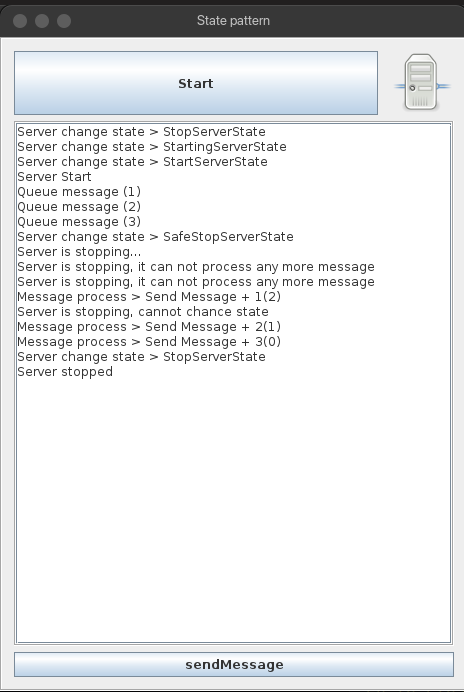
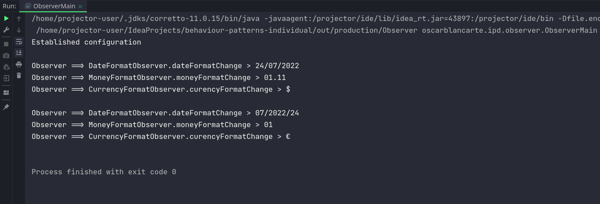
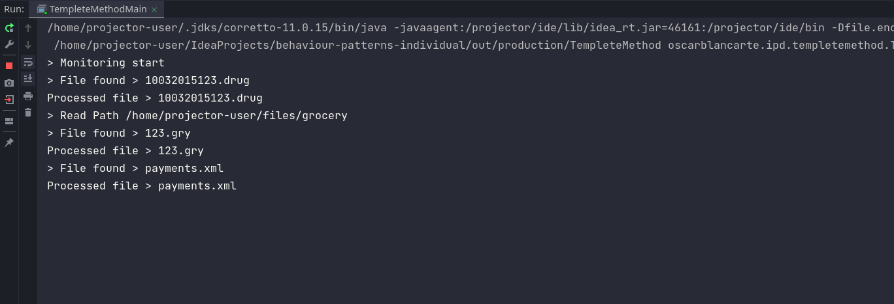
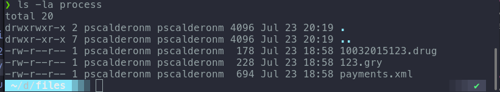

# 

<a>

</a>

# Tarea de Patrones de Comportamiento

**Integrantes:**

* Pablo Sebastian Calderon Maldonado

**Repositorio:** [design-patterns/behavior-patterns· GitHub](https://github.com/pscalderonm/behaviour-patterns-individual)

-------------------

## Patrón State

> Usando el patrón State, tomando como base el ejemplo del servidor,
implementar un apagado seguro. Este funcionaria de la siguiente
manera:

>Una vez establecido no permite enviar más mensajes y el servidor no
debe apagarse hasta que todos los mensajes que entraron (antes de
establecer el estado) sean procesados. Una vez que el servidor se
apague cambiará su estado al de Apagado.

#### Solucion del problema

Para empezar, se requiere crear un nuevo estado "intermedio" que valide dos cosas antes de establecer el estado final de `StopServerState`

1. Debe validar de que no existan mensajes pendientes de ser "procesados"
2. No debe permitir manejar mas mensajes mientra esté en este estado

La clase con el nuevo estado intermedio es la `SafeStopServerState`

``` java
public class SafeStopServerState extends AbstractServerState {

    public SafeStopServerState(final Server server){

        new Thread(new Runnable() {
            @Override
            public void run() {
                System.out.println("Server is stopping...");
                try {
                    while (true) {
                        if (server.getMessageProcess().countMessage() <= 0) {
                            server.setState(new StopServerState(server));
                            break;
                        }
                        Thread.sleep(250);
                    }
                    System.out.println("Server stopped");
                } catch (Exception e) {
                    System.out.println(e.getMessage());
                }
            }
        }).start();
    }

    @Override
    public void handleMessage(Server server, String message) {
        System.out.println("Server is stopping, it can not process any more message");
    }
}
```

Luego de ello y para tener control durante la fase de cambio de estados en el objeto `Server`, se agrega una validación mas para evitar cambiar a otro estado mientras se está en el estado `SafeStopServerState`

``` java
public void setState(AbstractServerState state) {
    ...
    if(this.state instanceof SafeStopServerState && 
            !(state instanceof StopServerState)) {
        System.out.println("Server is stopping, " +
                "cannot chance state");

        return;
    }

    this.state = state;
    System.out.println("Server change state > " + 
            this.state.getClass().getSimpleName());
}
```

Por último, y a modo de forzar la validación anterior cuando se hace clic sobre el botón principal, mientras se está en el estado de **Cierre Seguro**

``` java
AbstractServerState state = server.getState();
        if (state instanceof StopServerState) {
            btnStart.setText("Stop");
            server.setState(new StartingServerState(server));
        } else {
            if (state instanceof StartingServerState) {
                server.setState(new StopServerState(server));
            //Here we force to apply validation rule within the server 
            } else if (state instanceof SafeStopServerState){
                server.setState(new StartServerState(server));
            }
            
            else {
                btnStart.setText("Start");
                server.setState(new SafeStopServerState(server));
            }
        }
```

#### Resultados obtenidos

Luego de aplicados los cambios y de correr el proyecto, se obtiene lo siguiente



Se pueden notar algunas cosas:
1. Cuando el servidor se inicia, se empieza a enviar algunos mensajes (3 en la imagen)
2. Se manda a apagar el servidor, el cual entra en el estado `SafeStopServerState`
3. Mientras el sevidor es esta apagando, se intenta enviar mas mensajes, a lo que el servidor responde inmediatamente con `Server is stopping, it can not process any more message`
4. Al mismo tiempo, se intenta ejecutar la acción `Start`, a lo cual el servidor responde con `Server is stopping, cannot chance state`
5. Luego de que todos los mensajes son procesados, el servidor pasa directamente al estado de `StopServerState`

De esta manera, se evidencia la ejecución del nuevo estado para el Apagado seguro del ejemplo.

## Patrón Observable

> Usando el patrón Observer, tomando como base el ejemplo del
administrador de configuracion, implementar una nueva configuración
en la clase ConfigurationManager la cual nos permita administrar
configurar el formato de moneda, es decir, el usuario podrá indicar que
su moneda será dólar ($) o euro (€). Además tendremos que crear un
nuevo observador que nos permita ser notificados de que el formato
ha cambiado.

#### Solución al problema

Para empezar, desarrollamos una nueva clase de tipo `Observer` que escuche eventos de cambio de tipo de moneda.
``` java
public class CurrencyFormatObserver implements IObserver {
  @Override
  public void notifyObserver(String command, Object source) {
    if(command.equals("currencyFormat")){
      ConfigurationManager conf = (ConfigurationManager) source;
      System.out.println("Observer ==> CurrencyFormatObserver.curencyFormatChange > "
              + conf.getCurrencyFormat());
    }
  }
}
```
Seguido de ello, se procede con modificar la clase `ConfigurationManager` para incluir la funcionalidad de cambio de moneda para el sistema, y de la misma manera, poder notificar a todos los subscriptores del evento en cuestión.

``` java
public class ConfigurationManager extends AbstractObservable {

  // The rest of the configuration types
  ...
  
  private String currencyFormat;

  // The rest of the configuration types
  ...
  
  public String getCurrencyFormat(){return currencyFormat;}

  public void setCurrencyFormat(String currencyFormat){
      this.currencyFormat = currencyFormat;
      notifyAllObservers("currencyFormat", this);
  }
}
```

Finalmente, incluímos como parte de las pruebas en el `ObserverMain`, las líneas para simular el cambio de moneda

``` java
...
CurrencyFormatObserver currencyFormatObserver = new CurrencyFormatObserver();
conf.addObserver(currencyFormatObserver);
conf.setCurrencyFormat("$");

//Se realiza otro cambio en la configuración
conf.setCurrencyFormat("€");

conf.removeObserver(currencyFormatObserver);

//Se realiza otro cambio en la configuración
conf.setCurrencyFormat("xx");
```

#### Resultados obtenidos

Como se puede apreciar, luego de ejecutado el cambio en cada parte del código, se dispara la notificación respectiva y el subscriptor la captura para presentar en consola el resultado.



## Patrón Template

> Usando el patrón Template, en el ejercicio de carga de pagos, vamos
agregar una nueva funcionabilidad.

> Agreguemos un nuevo archivo que nos permita recibir los pagos
realizados por medio de cargos automáticos, este archivo nos lo envía
el banco y contiene los cargos realizados a los clientes directamente
sobre su tarjeta de crédito/débito. El formato del archivo será en XML
y tendrá la estructura que más te guste. El procesamiento y el log
deberán tener las reglas ya conocidas.

#### Solución al problema

>**NOTA: Cambiar la referencia al path en donde se encuentran los archivos para correr la prueba. Así mismo tener creado los directorios logs y process para que el proceso genere los logs y mueva los archivos ya procesados** 

Para llevar a cabo esta tarea, fue necesario desarrollar dos clases de ayuda, una de tipo Factory para obtener el objeto que permite la lectura del XML y otra para poder generar el archivo de logs en el mismo formato XML.

La clase para generar el objeto que permitirá leer y escribir el XML
``` java
public class XmlDocumentFactory {

    public static Document getDefaultWritableXmlDocument() throws Exception{
        DocumentBuilderFactory docFactory = DocumentBuilderFactory.newInstance();
        DocumentBuilder docBuilder = docFactory.newDocumentBuilder();
        return docBuilder.newDocument();
    }

    public static Document getDefaultReadableXmlDocument(File file) throws Exception{
        DocumentBuilderFactory docFactory = DocumentBuilderFactory.newInstance();
        docFactory.setFeature(XMLConstants.FEATURE_SECURE_PROCESSING, true);
        DocumentBuilder docBuilder = docFactory.newDocumentBuilder();
        return docBuilder.parse(file);
    }
}
```
, y la clase para generar el log en el mismo formato XML
``` java
private static class XmlLogger {

    private final Document document;
    private final Element rootElement;

    public XmlLogger() throws Exception{
        document = XmlDocumentFactory.getDefaultWritableXmlDocument();
        rootElement = document.createElement("logs");
        document.appendChild(rootElement);
    }

    public void writeLog(String id, String customer, String date, String message){
        //Content to build a log element into the XML
        ...
    }

    public void writeXML(OutputStream outputStream) {
        //Content to write out the xml content to a Stream such as a File.
        ...
    }
}
```

Luego de disponibilizada las dos clases, se procede con crear la nueva clase concreta `PaymentFileProcess`

``` java
public class PaymentsFileProcess extends AbstractFileProcessTemplete {

    private final XmlLogger xmlLogger = new XmlLogger();

    public PaymentsFileProcess(File file, String logPath, String movePath) throws Exception {
        super(file, logPath, movePath);
    }

    @Override
    protected void validateName() throws Exception {
        String filename = file.getName();
        if(!filename.endsWith(".xml")){
            throw new Exception("Invalid file name"+
                    ", must end with .xml");
        }

        XmlDocumentFactory.getDefaultReadableXmlDocument(file);
    }

    @Override
    protected void processFile() throws Exception {
        Document doc = XmlDocumentFactory.getDefaultReadableXmlDocument(file);
        doc.getDocumentElement().normalize();

        NodeList list = doc.getElementsByTagName("payment");
        for(int idx=0; idx< list.getLength(); idx++) {
            Node node = list.item(idx);
            if (node.getNodeType() != Node.ELEMENT_NODE) {
                continue;
            }

            Element element = (Element) node;
            String uid = element.getElementsByTagName("uid").item(0).getTextContent();
            String customerId = element.getElementsByTagName("customer").item(0).getChildNodes().item(1).getTextContent();
            BigDecimal amount = BigDecimal.valueOf(Double.parseDouble(element.getElementsByTagName("amount").item(0).getTextContent()));
            String date = element.getElementsByTagName("transactionDate").item(0).getTextContent();
            boolean exists = OnMemoryDataBase.customerExist(Integer.parseInt(customerId));

            if(!exists){
                xmlLogger.writeLog(uid, customerId, date, "Customer not exists");
            } else if(amount.compareTo(new BigDecimal(1000)) >= 0){
                xmlLogger.writeLog(uid, customerId, date, "The amount exceeds the maximum");
            }else{
                xmlLogger.writeLog(uid, customerId, date, "Successfully applied");
            }
        }
    }

    @Override
    protected void createLog() throws Exception {
        FileOutputStream out = null;
        try{
            File outFile =  new File(logPath+"/"+file.getName());
            if(!outFile.exists()){
                outFile.createNewFile();
            }
            out = new FileOutputStream(outFile, false);
            xmlLogger.writeXML(out);
            out.flush();
        }finally {
            out.close();
        }
    }

    ...
}
```

Finalmente, agregamos la instancia dento de la clase Principal del proyecto `TempleteMethodMain` para la lectura y procesamiento de un archivo de pagos ficticio en formato XML.

``` java
...

f = new File(PATHS[2]);
if(!f.exists()){
    throw new RuntimeException("El path '"+PATHS[2]+"' no existe");
}
File[] paymentFiles = f.listFiles();
for(File file : paymentFiles){
    try{
        System.out.println("> File found > "+file.getName());
        new PaymentsFileProcess(file, LOG_DIR, PROCESS_DIR).execute();
        System.out.println("Processed file > "+file.getName());
    }catch (Exception e){
        System.err.println(e.getMessage());
    }
}
...
```

El archivo a leer es el siguiente `payments.xml`
``` xml
<?xml version="1.0" encoding="UTF-8" ?>
<payments>
    <payment>
        <uid>0001</uid>
        <customer>
            <id>10</id>
        </customer>
        <amount>1000</amount>
        <transactionDate>2022/07/23T12:00:00Z</transactionDate>
    </payment>
    <payment>
        <uid>0002</uid>
        <customer>
            <id>20</id>
        </customer>
        <amount>569.20</amount>
        <transactionDate>2022/07/3T8:00:00Z</transactionDate>
    </payment>
    <payment>
        <uid>0003</uid>
        <customer>
            <id>50</id>
        </customer>
        <amount>987.90</amount>
        <transactionDate>2022/07/30T14:00:00Z</transactionDate>
    </payment>
</payments>
```

#### Resultados obtenidos

Como se puede apreciar, el nuevo archivo en formato XML es procesado



junto con los logs generados (en formato XML)

``` xml
<?xml version="1.0" encoding="UTF-8" standalone="no"?>
<logs>
    <log>
        <id>0001</id>
        <customer>10</customer>
        <date>2022/07/23T12:00:00Z</date>
        <message>The amount exceeds the maximum</message>
    </log>
    <log>
        <id>0002</id>
        <customer>20</customer>
        <date>2022/07/3T8:00:00Z</date>
        <message>Successfully applied</message>
    </log>
    <log>
        <id>0003</id>
        <customer>50</customer>
        <date>2022/07/30T14:00:00Z</date>
        <message>Successfully applied</message>
    </log>
</logs>

```
Los archivos procesados
